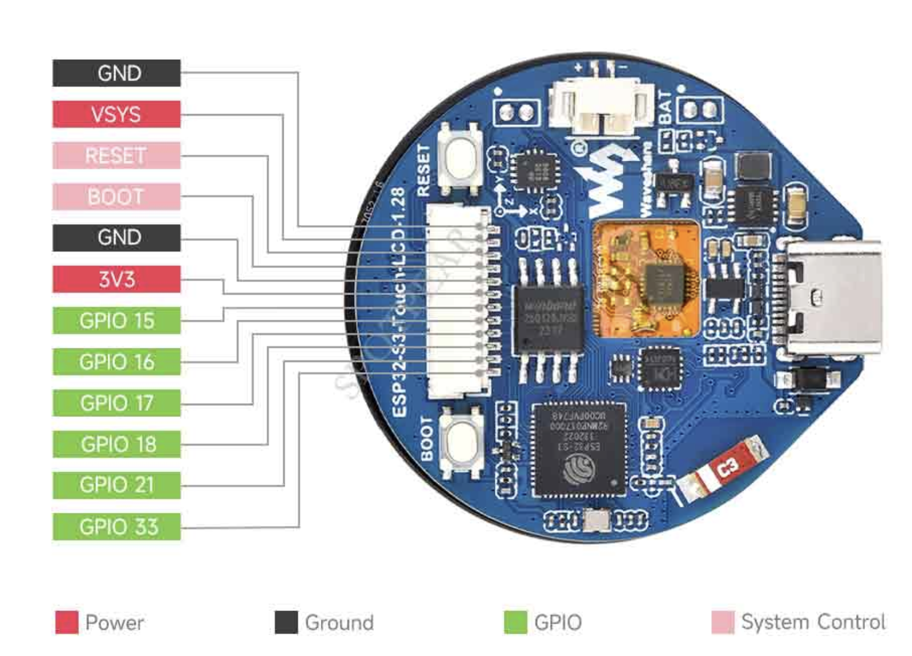
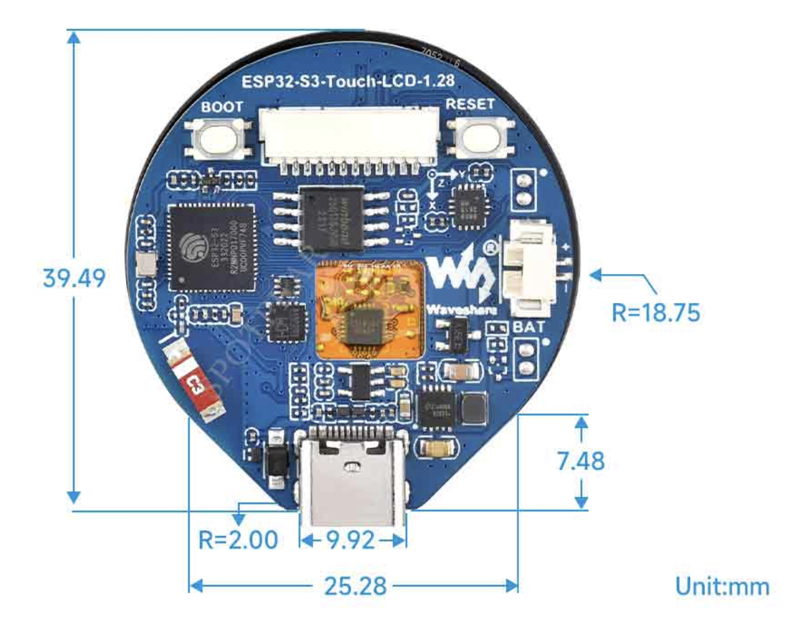
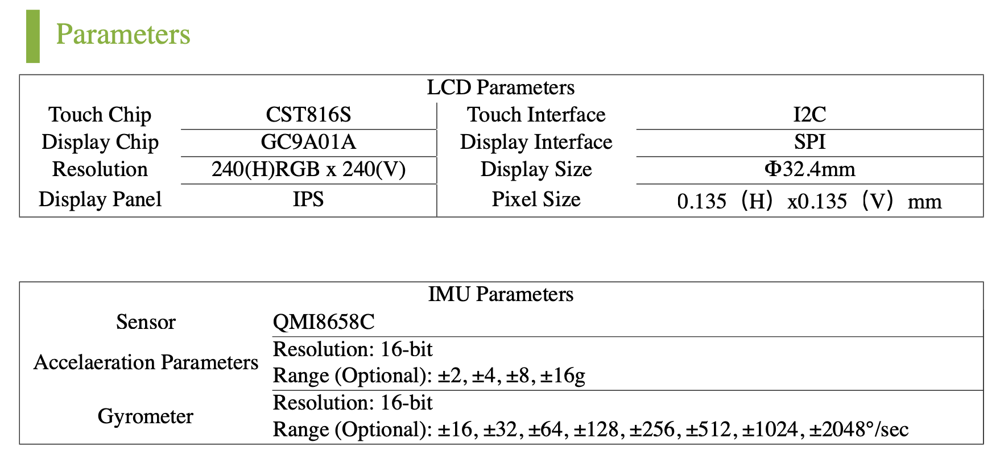

# ESP32-S3 module with round 1.28' TFT display, cap-touch and IMU devices.

Test program prints the device ID on I2C0 and I2C1 bus.

## Device on I2C0/1:
CST816S and QMI8658 are attached to I2C0 bus (included on PCB module).
BME280 is attached to I2C1 bus (socket pins)

## Socket pinout:

## PCB info:

## Module info:
